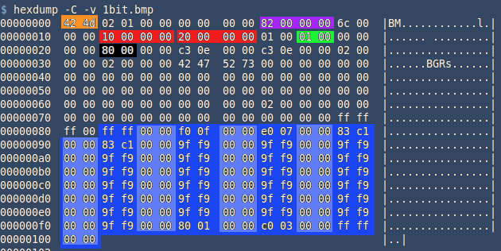

# bmp2c

Create a C header-file that contains a C-array of the bitmap file's content in 1-bit colour depth.

# Synopsys

Embedded displays do not have the sophisticated graphical display abstractions
that we are so used to in the worlds of laptops, tablets, smartphones and game consoles.
Instead, images are displayed by writing a value to each pixel on the display. 
The display is typically a 2-colour display, such as the so-called 'e-paper' that we 
see on Kindle devices and wrist watches, OLED and LCD displays. File-size of graphical
resources on embedded devices still plays a significant role in the business of IoT
development, which is why it is so important that the colour space is limited to 1-bit / 2 colours only.
From what I can tell, none of the other utilities out there can produce a 1-bit colour-space file.

This article describes how to create C-code in the form of a C-array from any image file
for direct rendering on embedded system 2-colour displays. You should then be able
to include this in your automated DevOps tool chain and deliver consistent results.


The end result is a ready-to-compile C header-file that contains the image data to displays a 2-colour image. 

With a few additional steps. it possible to generate display code for 3-colour embedded displays, but will limit ourselves to the simpler case here of 2 colours.

Expect to see some interesting BASH techniques here!

# Requirements

You will need to have `ImageMagick` installed, and the usual gang of Linux utilities,
such as hexdump and the non-sensically-named `xxd` utility. As a general rule, I use icons
exclusively from `Font Awesome` in my front-end development (both web and embedded), since there
is a huge variety of icons on offer and because of the consistent styling among them. The icons
also come in several variants, my preference is the "regular" variant.

# Select your source image

We start with the downloading of the FontAwesome desktop package from https://fontawesome.com/download. 
Unpack it and select your source icon from the svgs directory and move it into your work area.
This file is still the scalable vector graphics format, the first manipulation is to convert it to a bitmap
and to simultaneously resize it. It is useful to leave a blank 1 pixel-wide border around display icons, 
we therefore aim to produce a 30x30 pixel bitmap first and then add the border afterwards to get to our 32x32 pixel bitmap. 


Starting image

> *Note:* The intermediate files that are produced are named a, b, c, etc... with appropriate extensions
> to help you keep track of the process.

# Creating a bitmap from your source

A BMP-file not only holds the rasterized image-data in a nice, continuous block of data, 
but in its header it also holds parameters to help display it, e.g. width, height, colour depth, etc. 
It is of course the rasterized image-data here that we are after and want convert into C-code.

We use the `convert` utility from ImageMagick to convert the SVG-file to a 30x30 pixel BMP-file.
```bash
$ convert exclamation-circle.svg -resize 30x30 a.bmp
```

Put a 1 pixel border around it to make it 32 x 32 pixels in size.
```bash
$ convert a.bmp -bordercolor white -border 1x1 b.bmp
```

Set the colour depth to 2 colours, so that we have a single bit per pixel in the end:
```bash
$ convert b.bmp -depth 2 c.bmp
```

Set the colour pallete to 2 colours:
```bash
$ convert c.bmp +dither -colors 2 -colorspace gray -contrast-stretch 0 d.bmp
```

A final tweak: Set to monochrome
```bash
$ convert d.bmp -monochrome d.bmp
```

Check that we have 2 colours and 1 bit per pixel:

```bash
$ identify d.bmp 
d.bmp BMP 32x32 32x32+0+0 1-bit sRGB 2c 274B 0.000u 0:00.000
```

Also look at some other bitmap file properties by doing a binary dump in hexadecimal:



The 1 at address 0x1C (in green) tells us that we are still dealing with a 1-bit, 2-colour depth image file.
We can also confirm that both width (at 0x12, in red) and height (at 0x16, in red) are 32 pixels (0x20).

# Finally - getting to the image data

So far, so good, but looking at the file format definition, the beginning of the image's raster-data
is not easy to determine due to all sorts of colour space definitions and arbitrary gaps being allowed for
in the specification. 
So rather than fathoming out the logic for the particular BMP-file that we are using, 
the easiest way to find the beginning of the image-data is to count backwards from the end of the file. 

Since we have 1 bit per pixel, and we have 32 x 32 = 1024 pixels, which amounts to 1024 bits, 
we can safely say that the last 1024 / 8 = 128 bytes of the file is image data. 

The curent bitmap file's size is 274 bytes: 

```bash
$ stat -c%s d.bmp
274
``` 

We therefore need to lopp off the leading 274 - 128 - 146 bytes from the file, so that we end up with the purest, bit-distilled, Highland-quality uncompromised image-data and put the result in file `e.raster` (strictly-speaking, this is not a Bitmap file any more). Confirm that the new raster file is 128 bytes in size:

```bash
$ dd if=d.bmp of=e.raster skip=146 iflag=skip_bytes,count_bytes
$ stat -c%s e.raster
128
```

Lucky for us, we chose to work with icon files of size 32x32, which fits neatly into the display format used by the `xxd`-utility. So when we display file `e.raster` in binary form (`-b`) in 4 columns (`-c 4`) of 8 bits each, we get:


Through the use of `sed` one can make out an exclamation mark icon without having to squint one's eyes, although it is upside down.
The image in BMP-files is stored upside down for reasons that hark back to the days of something called OS/2. Oh dear.

# Fixing the upside-down problem

On a typical embedded system, the inclination would be to program the display of raster images 
such that they start from the top left corner. This is annoying but we can fix this here by reversing the content 
on a bit-wise basis. Reversing a the byte-level will deliver some interesting resuts! 
If this does not bother you, skip this next step:

On the first line below, we crack the binary file 'e.raster' into a long string of binary 1s and 0s and reverse the string (in one step).
Then we reconstitute the binary file by chunking the binary string up into 8-character long chunks and converting each binary chunk
directly into a hexadecimal string with the printf statement, 
which is then passed to the magic 'xxd' utility that converts the hex string to binary and appends it to the file `f.raster`. 

```bash
rm f.raster 2>/dev/null
binstr=$(xxd -b -c 1 e.raster | cut -f 2 -d " " | sed -E 's/(.)/\1 /g' | tr '\n' ' ' | sed -E 's/ //g' | rev )
for ((i=0;i<${#binstr};i+=8)); do 
  binchar=${binstr:$i:8}  
  printf "%02X " $((2#${binchar})) | xxd -r -p >> f.raster
done
```

A quick check reveals that the image is now the correct way around:


Check that this raster file is still 128 bytes in size:

```bash
$ stat -c%s f.raster
128
```

# Generation of the C header-file 

Again, the magic workings of the 'xxd' utility comes into play to generate the C-array
from the binary raster file. You can pipe this output into a C header-file:

```bash
$ xxd -i f.raster >> bitmaps.h
$ cat bitmaps.h

unsigned char f_raster[] = {
  0xff, 0xff, 0xff, 0xff, 0xff, 0xfe, 0x7f, 0xff, 0xff, 0xe0, 0x07, 0xff,
  0xff, 0x80, 0x01, 0xff, 0xfe, 0x03, 0xc0, 0x7f, 0xfc, 0x1f, 0xf8, 0x3f,
  0xf8, 0x7f, 0xfe, 0x1f, 0xf0, 0xff, 0xff, 0x0f, 0xf1, 0xff, 0xff, 0x8f,
  0xe3, 0xfc, 0x3f, 0xc7, 0xe3, 0xfc, 0x3f, 0xc7, 0xc7, 0xfc, 0x3f, 0xe3,
  0xc7, 0xfc, 0x3f, 0xe3, 0xc7, 0xfc, 0x3f, 0xe3, 0xcf, 0xfc, 0x3f, 0xf3,
  0x8f, 0xfc, 0x3f, 0xf1, 0x8f, 0xfc, 0x3f, 0xf1, 0xcf, 0xfc, 0x3f, 0xf3,
  0xc7, 0xff, 0xff, 0xe3, 0xc7, 0xfe, 0x7f, 0xe3, 0xc7, 0xfc, 0x3f, 0xe3,
  0xe3, 0xfc, 0x3f, 0xc7, 0xe3, 0xfc, 0x3f, 0xc7, 0xf1, 0xfe, 0x7f, 0x8f,
  0xf0, 0xff, 0xff, 0x0f, 0xf8, 0x7f, 0xfe, 0x1f, 0xfc, 0x1f, 0xf8, 0x3f,
  0xfe, 0x03, 0xc0, 0x7f, 0xff, 0x80, 0x01, 0xff, 0xff, 0xe0, 0x07, 0xff,
  0xff, 0xfe, 0x7f, 0xff, 0xff, 0xff, 0xff, 0xff
};
unsigned int f_raster_len = 128;
```

You can see that the name of the raster file is used in the variable name of 
the C-array. A useful convention is to retain the original icon name throughout
the process and to append the size attributes to the file name, e.g. the final
file name would in this case be exclamation-circle.32x32, to end up with the 
variable name like this: `unsigned char exclamation-circle_32x32[]`.

# Conclusion

All this witty wisdom has been put together in a utility written in BASH called
`bmp2c` (see https://github.com/gerritonagoodday/bmp2c), which, as far as I can
tell, is the only script that delivers 1-bit colour output for any given image
type. That's why I wrote it, after all - I needed this feature! 

## A quick synopsis:

```bash
bmp2c -f=filepath -h=height -w=width --stretch|-s --output|-o --verbose|-v

OPTIONS (Note that there is an '=' sign between argument and value):
  -f, --file=[full path to file if in other directory]
          The file name of the source image. It can be type of image file and
          of any size or form factor.
  -w, --width=[target width in pixels]
          This is the (horizontal) width of the target file in pixels. If you
          don't specify either the width or the height, the width will default
          to 32 pixels and the height will be determined by the aspect ratio of
          the source image.
  -h, --height=[target height in pixels]
          This is (vertical) height of the target file in pixels and if not
          specified, this dimension will be calculated for you based on the
          aspect ratio of the source image and the width dimension that you
          specified. If you only specify the height but not the width, then the
          width is likewise calculated based on the source image aspect ratio. 
  -s, --strech Option
          You can specify both width and height dimensions such that they do
          not correspond to the source images aspect ratio. If you specify the
          "stretch" option, then the source image will be deformed to fill the
          entire target canvas. If this option is not selected, then whitespace
          is padded into the surrounding space that is created. This option 
          will be ignored if neither the width nor height are specified.
  -o, --output Option
          Produce output header file named according to the source image 
          filename, without having to do any redirection. The ouput file will
          created in the current working directory, with an .h extension.
  -v, --verbose Option
          Verbose screen output. All output will also be logged.
  -d, --debug Option
          Output debug messages to screen and log.           
  -h, --help Option
          Displays this text 
```

## Fun things to do

Since this is a command-line utiity, you can do clever things like converting
an entire directory of icon files into C header-files:

```bash
$ for i in fontawesome-free-x.x.x-web/svgs/regular/*; do bmp2c -f=$i -o; done
```

Or, if you want all your image arrays in be held in one C header-file:

```bash
$ printf "#ifndef _BITMAPS_H_\n#define _BITMAPS_H_\n\n" > bitmaps.h
$ for i in fontawesome-free-x.x.x-web/svgs/regular/*; do bmp2c -f=$i >> bitmaps.h; done
$ printf "\n#endif /* _BITMAPS_H_ */\n" >> bitmaps.h
```

## A quick implementation on ePaper

```bash
$ bmp2c.sh -f fontawesome-free-x.x.x-web/svgs/regular/hammer.svg -o
```
This produces the header file, hammer.h:
```C
#ifndef _HAMMER_H_
#define _HAMMER_H_

const unsigned char hammer_32x28[] = {
  0xff, 0xff, 0xff, 0xff, 0xff, 0xe0, 0x7f, 0xff, 0xff, 0xc0, 0x1f, 0xff,
  0xff, 0x82, 0x0f, 0xff, 0xff, 0x1f, 0x1f, 0xff, 0xfe, 0x3e, 0x3f, 0xff,
  0xfc, 0x7c, 0x7f, 0xff, 0xf8, 0xfc, 0x7f, 0xff, 0xf8, 0xfc, 0x7f, 0xff,
  0xf8, 0xf8, 0x7f, 0xff, 0x81, 0xf0, 0x3f, 0xff, 0x83, 0x83, 0x1f, 0xff,
  0xc3, 0x01, 0x8f, 0xff, 0xe0, 0x30, 0xc7, 0xff, 0xf0, 0x78, 0x63, 0xff,
  0xf8, 0x7c, 0x71, 0xff, 0xfc, 0x7e, 0x38, 0xff, 0xfe, 0xff, 0x1c, 0x7f,
  0xff, 0xff, 0x8e, 0x1f, 0xff, 0xff, 0xc7, 0x0f, 0xff, 0xff, 0xe3, 0x87,
  0xff, 0xff, 0xf1, 0xc3, 0xff, 0xff, 0xf8, 0xe3, 0xff, 0xff, 0xfc, 0x73,
  0xff, 0xff, 0xfe, 0x03, 0xff, 0xff, 0xfe, 0x07, 0xff, 0xff, 0xff, 0x0f,
  0xff, 0xff, 0xff, 0xff
};
unsigned int hammer_32x28_len = 112;

#endif   /* _HAMMER_H_ */
```

Create an Arduino project on either the Arduino or the PlatformIO development platform, 
include the libraries GxEPD2, Adafruit BusIO, Adafruit GFX, Wire, SPI and rig up your
favourite MCU and e-paper display. Here, I used an ESP32 DoItDevKitV1 MCU and a 2.9" 
e-paper display from Waveshare. Be warned, the GPIO connection vary wildly from MCU to MCU.

```cpp
#include <Arduino.h>
#include "hammer.h" 
#include <GxEPD2_BW.h>
// Instantiate display and set esp32doit-devkit-v1 GPIOs to signals CS,DC,RST,BUSY
GxEPD2_BW<GxEPD2_290, GxEPD2_290::HEIGHT> display(GxEPD2_290(17,16,5,19)); 

void setup(){
  display.init(115200);  
  display.drawImage(hammer_32x28,20,10,32,28,false,false,true);  
}

void loop(){}
```

Image display on a 2-color Waveshare e-paper display

# References

* https://fontawesome.com/ Font Awesome
* https://imagemagick.org/index.php ImageMagick
* https://en.wikipedia.org/wiki/BMP_file_format  BMP-File format specification
* https://www.waveshare.com/wiki/2.9inch_e-Paper_Module An example ePaper module specification
* https://github.com/ZinggJM/GxEPD2 Arduino Display Library for SPI E-Paper Displays
